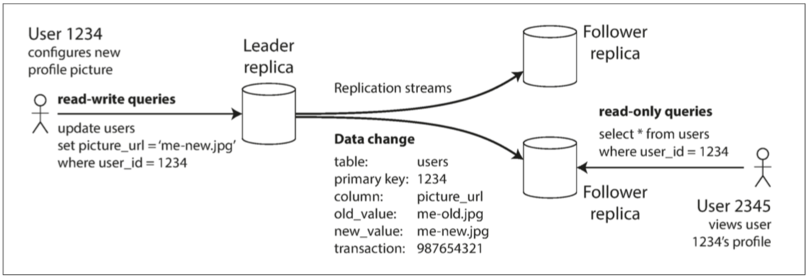
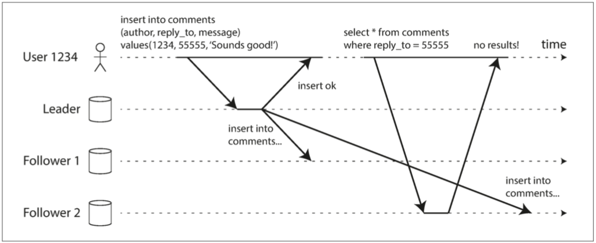
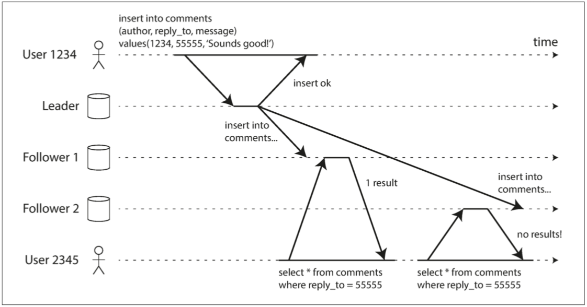

>复制意味着在通过网络连接的多台机器上保留相同数据的副本。

**复制的动机：**
- 使数据离用户更近->减少延迟
- 容错->提高可用性
- 横向、纵向扩展方便->提高吞吐量

**复制的难点：**
多份数据的一致性->即数据会变更，如何让多节点数据一致

**复制的方式：**
- 单主
- 无主
- 多主

权衡：使用同步复制还是异步复制？如何处理失败的副本？

### 有主的复制
---
 

**同步复制：**
数据发送后持久化才返回
- 优点：从库能保证有与主库一致的最新数据副本
- 缺点： 从库无响应会导致主库无法处理写入
>半同步（semi-synchronous:
>一个从库是同步的，而其他的从库则是异步的

**异步复制：**
数据不保证在副本上落盘
- 优点：低延迟
- 缺点：一致性不强

#### 成员变更-新增从节点
流程：
1. 在某个时刻获取主库的一致性快照（如果可能，不必锁定整个数据库）。大多数数据库都具有这个功能，因为它是备份必需的。对于某些场景，可能需要第三方工具，例如用于 MySQL 的 innobackupex
2. 将快照复制到新的从库节点。
3. 1从库连接到主库，并拉取快照之后发生的所有数据变更。这要求快照与主库复制日志中的位置精确关联。该位置有不同的名称，例如 PostgreSQL 将其称为 **日志序列号（log sequence number，LSN）**，MySQL 将其称为 **二进制日志坐标（binlog coordinates）**。
4. 当从库处理完快照之后积累的数据变更，我们就说它 **赶上（caught up）** 了主库，现在它可以继续及时处理主库产生的数据变化了。

#### 处理节点失效
- 从库失效->catch up

- 主库失效->故障切换
    1. 确认主库失效。
    2. 选一个新的主库
    3. 重新配置系统以启用新的主库

**故障切换的难点：**
- 存在旧主的已提交未提交的数据如何处理？
- 新主的数据是否正确
- 主库被宣告死亡之前的正确超时应该怎么配置？在主库失效的情况下，超时时间越长意味着恢复时间也越长。但是如果超时设置太短，又可能会出现不必要的故障切换。例如，临时的负载峰值可能导致节点的响应时间增加到超出超时时间，或者网络故障也可能导致数据包延迟。如果系统已经处于高负载或网络问题的困扰之中，那么不必要的故障切换可能会让情况变得更糟糕。
- 单主集群出现脑裂，却没有多主集群的冲突处理机制
> **屏障（fencing）**
> **爆彼之头（Shoot The Other Node In The Head, STONITH）**
> 我们将在 “[领导者和锁](http://ddia.vonng.com/#/ch8?id=%e9%a2%86%e5%af%bc%e8%80%85%e5%92%8c%e9%94%81)” 中对屏障进行详细讨论。

All in all:
节点故障、不可靠的网络、对副本一致性、持久性、可用性和延迟的权衡，这些问题实际上是分布式系统中的基本问题。

### 复制日志的实现

1. 基于语句的复制
    - 注意语句在不同节点的影响
2. WAL(Write Ahead Log) (==todo==)
    - 对于日志结构存储引擎（请参阅 “[SSTables 和 LSM 树](http://ddia.vonng.com/#/ch3?id=sstables%e5%92%8clsm%e6%a0%91)”），日志是主要的存储位置。日志段在后台压缩，并进行垃圾回收。
    - 对于覆写单个磁盘块的 [B 树](http://ddia.vonng.com/#/ch3?id=b%e6%a0%91)，每次修改都会先写入 **预写式日志**，以便崩溃后索引可以恢复到一个一致的状态。
3. 基于行的日志（逻辑日志复制）
    - mysql binlog设置参数后就是基于行
    - 逻辑日志与存储引擎的内部实现是解耦的，系统可以更容易地做到向后兼容，从而使主库和从库能够运行不同版本的数据库软件，或者甚至不同的存储引擎。
4. 基于触发器的复制
    - 基于触发器的复制通常比其他复制方法具有更高的开销，并且比数据库内置的复制更容易出错，也有很多限制。
    - 灵活性不错，

1、2、3由数据库系统实现，4在应用层实现

### 复制的延迟问题
多节点之间异步复制时造成的不同节点之间的数据不一致。

#### 读本节点的写入

**read-your-writes consistency（写后读一致性）**：如果用户重新加载页面，他们总会看到他们自己提交的任何更新。不对其他用户做出承诺

有主复制系统如何实现“写后读一致性”？

#### 单调读（monotonic reads）
- 多次读取只会读到比以前新的版本，但不保证为最新版本
- 强一致性< mr <最终一致性

#### 前缀一致读（consistent prefix reads）
- 按照某个顺序写入数据的写请求，读取时也会按照当时写入的顺序返回。
- 顺序错乱通常发生在有分区分片的数据库中
- 实现前缀一致性的一种方案是确保任何具有因果顺序关系的写入都交给一个分区来完成，但是该方案实现后效率不高。

#### 复制延迟的解决方案
==//todo==
分布式事务 VS 单机事务

### 多主复制
==//todo//

### 无主复制
==//todo==

